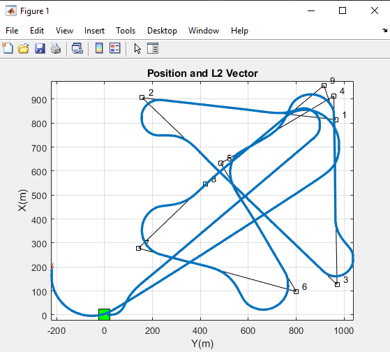

# UAS Guidance and Navigation Control using Software-in-the-Loop Simulation

## Installation

Our project requires the following applications to run: 
- MATLAB R2022b or later
- MATLAB Aerospace Blockset
- MATLAB Control Systems Toolbox
1. Download the .zip file provided and extract to a folder which you can easily navigate to.
2. Open MATLAB and use the 'Open Folder' button to open the directory where the project files were extracted to.
3. Run the following commands from the MATLAB command window: 

```sh
openProject('MBDRI.prj');
configSim;
initWaypoints;
runShortFlight;
```

4. When the simulation is configured, a window will pop up which asks you to select a task and activate it. You can ignore this window for our project.

## Output

This should produce five plots, the first being an XY plot of a complete mission around 9 waypoints, as shown below:



## Demonstration

A video demonstrating the application can be found here: 

<iframe width="560" height="315" src="https://www.youtube.com/embed/No2FxULzqHI" title="YouTube video player" frameborder="0" allow="accelerometer; autoplay; clipboard-write; encrypted-media; gyroscope; picture-in-picture; web-share" allowfullscreen></iframe>
